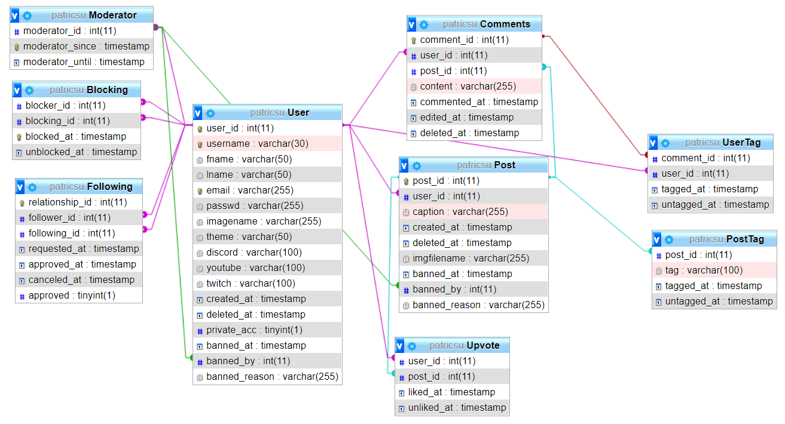

# GamerVibe-Website
Instagram for gamers, a place to share in game images and gamer persona

## Demo Video
[Demo Video Link](https://drive.google.com/file/d/1v5fgSUze6A3vtSqU9D_mQt_0lT6t0NpC/view?usp=sharing)

## Functionality
Anonymous visitors can view public posts in Discovery and searcj for pubic posts undera search.

Registered users can add and delete post, like/unlike and comment posts. They can also follow other users, including those with private accounts or block users.

Moderators can on top of that ban user accounts.

## Quick set-up
> npm i

### Generate keys and certificate (below for local version)
> openssl genrsa -out ssl-key.pem 2048\
> openssl req -new -key ssl-key.pem -out certrequest.csr\
> openssl x509 -req -in certrequest.csr -signkey ssl-key.pem -out ssl-cert.pem

### Environment variables in .env
> DB_HOST=\<your-db\>\
> DB_USER=\<your-db-user\>\
> DB_PASS=\<your-db-password\>\
> DB_NAME=\<your-db-name\>\
> PROXY_PASS=/app\
> HTTPS_PORT=8000\
> HTTP_PORT=3000

### To run app
> node app.js

## End points
### /auth/register (post)
For registering new users. Returns user information and login token.\
#### Params
**username**: minimum of 3 characters, max 30 characters\
**email**: type must be email\
**password**: at least 8 characters long and contain 1 uppercase character

### /auth/login (post)
For login user in. Returns user information and login token.
#### Params
**email**\
**password**

### /auth/logout (get)
For login user out.

### /ban (get)
Return true if current user is banned or deleted

### /ban (put)
Moderator can ban users
#### Params
**bannedId**: int, user that is banned\
**reason**: max 255 characters

### /ban (delete)
Moderator can unban users
#### Params
**bannedId**: int, user that is unbanned

### /block (get)
Get list of users that are blocked by current user

### /block (put)
Block user
#### Params
**blockedId**: int, userId that wanted to block

### /block (delete)
Unblock user
#### Params
**blockedId**: int, userId that wanted to unblock

### /follow (post)
Follow user
#### Params
**user**: following user id, int

### /follow (delete)
Unfollow user
#### Params
**user**: following user id, int

### /follow/:id (get)
Return true if current user is following user with given id

### /post (post)
Needs **multipart/form-data**. For posting new post. Returns created post.
#### Params
**gameImage**: JPEG || PNG\
**caption**: min 1 char, max 255 chars

### /post/comment (post)
Make a new comment.
#### Params
**postId**: numeric\
**content**: max 255 characters

### /post/upvote (post)
Like post
#### Params
**postId**: numeric

### /post/upvote/:id (get)
Check if user is upvoted post
#### Params
**id**: posts id that wanted to check

### /post/id/:id (get)
Get post information.
Returns posts content, upvotes, tags and comments.
#### Params
**id**: int

### /post/id/:id (delete)
Delete selected post, if the logged user is the original poster or moderator.
#### Params
**id**: int

### /posts/discover (post)
Get multiple public posts. Return list of posts with comments, upvotes and tags.
#### Params
amount: int\
**beginId**: int, show posts before this id, not mandatory\
**userId**: int, don’t show posts from this user

### /posts/following (post)
Get those users posts that user is following
#### Params
**beginId**: int, if given then shows posts that are older than post with given id\
**amount**: int, if given then shows that many posts

### /posts/feed (post)
Posts from user itself
#### Params
**beginId**: int, if given then shows posts that are older than post with given id\
**amount**: int, if given then shows that many posts

### /user (put)
Update users information. If some params are not in body, then users' previous information is used for that field, else it will be overwritten even if the field is empty.
#### Params
**fname**: Max 50 characters\
**lname**: Max 50 characters\
**discord**: URL, Max 100 characters\
**twitch**: URL, Max 100 characters\
**youtube**: URL, Max 100 characters\
**private**: 1 || 0\
**profilePic**: JPEG || PNG

### /user/id/:id (get)
Get user information
Return user object
#### Params
**id**: int

### /user/following (get)
Uses Bearer Token to get current user. Returns list of who is following user

### /user/followers (get)
Uses Bearer Token to get current user. Returns list of who user is following

### /user/posts (get)
Return list of posts posted by current user.

## Folders
### /
For web pages.

### /thumbnails
Thumbnail folder.

### /uploads
Full size images.

### /profile-pics
For profile pictures

## Database design

